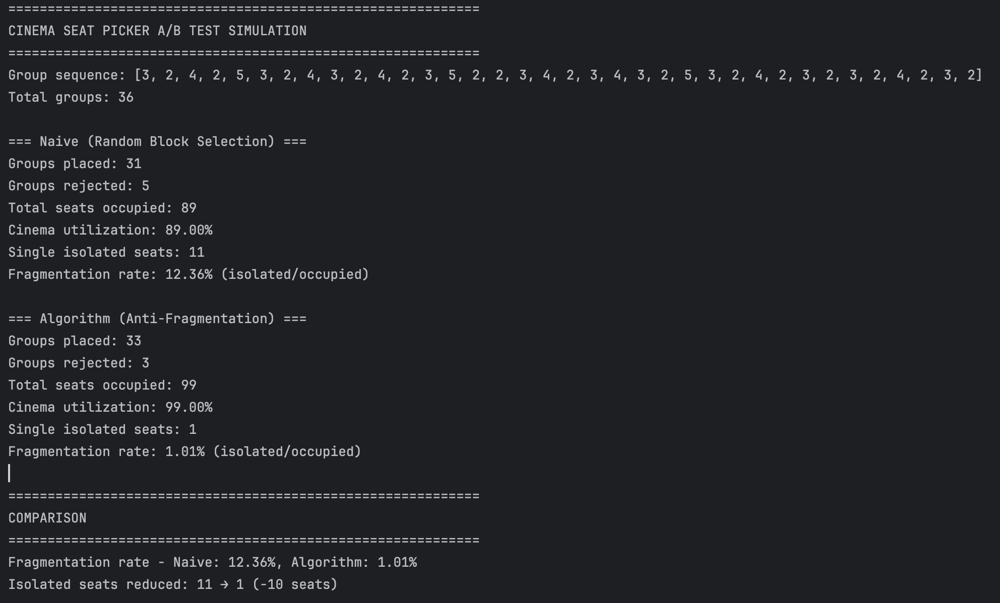

# Evaluering:

## Hvordan algoritmen fungerer:

Frontend sender brugerens valg af sæder til backend. checkSeats() tjekker først om ordren skaber isolerede sæder ved at tjekke ledigheden af sædet ved siden af ordren, hvis naboen er ledig tjekker den naboens nabo.
Hvis naboens nabo er optaget, så er der skabt et isoleret sæde.
Hvis der er skabt et isoleret sæde, looper hasValidAlternatives() over hele biografen for at finde grupper af ledige sæder som matcher ordrens størrelse eller ordrens størrelse + 2.
hasValidAlternatives() har enten fundet et sted i biografen som ikke skaber fragmentering og afviser ordren, og derved lader brugeren finde dette alternativ på egen hånd.
Hvis den IKKE har fundet et alternativ, så tillader den fragmentering og accepterer ordren.

## Overvejelser:

Jeg har valgt at overlade en del af beslutningerne til brugeren. Man kan forstille sig et UI som både returnerer tjekket for isolerede sæder,
og viser brugeren et bedre alternativ. Jeg valgte at gribe det anderledes an og blot tjekke om der findes et alternativ,
som matcher ordrens størrelse eller ordrens størrelse + 2. Hvis den finder sådan et match, betyder det at der findes et bedre alternativ som ikke skaber isolerede sæder.
Backend afviser så ordren og lader det være op til brugeren selv at finde dette alternativ som ikke bryder reglerne.

Oprindeligt tillod jeg brugeren at bestille sæder på forskellige rækker. Denne beslutning betød at metoden som tjekker for isolerede sæder (doesSelectionCreateFragmentation()) skulle loope over alle rækker i biografen. Det øger kompleksitets faktoren.
Selvom biografer ikke er så store at kompleksitets faktoren ville blive et egentligt problem, valgte jeg, for at vise forståelse for emnet, at sætte den begrænsning at brugeren kun kan vælge sæder fra én række.
Begrænsningen sker i frontend, som prompter brugeren at man skal vælge udelukkende fra én række.

Til opgaven skulle jeg tage en beslutning om hvordan rækker og sæder skulle repræsenteres i koden. Jeg overvejede at lave en database med to tabeller, men besluttede at det ville være overkill til opgaven.
Jeg gik i stedet med et hardcodet HashMap med rækker som key og en liste af sæder som value. Valget af datastruktur er lidt et artefakt fra tidligt i processen hvor mit biograf layout havde flere sæder jo længere bagud i biografen man var. 
Efter lidt frem og tilbage med ChatGPT besluttede jeg da, at hashmap var den letteste vej at gå. Jeg er ret sikker på at ChatGPT foreslog dette med henblik på skalering i fremtiden.
Det kunne lige så vel have været en liste med en lister af sæder uden de store ændringer i koden udover håndtering af zero index.

## Simulering:

For at vurdere effektiviteten af pladsvælger algoritmen,
har jeg valgt at simulere to måder at fylde biografsalen på:
Datasettet består af 36 grupper med 2-5 personer hver.

Naiv pladsvælger: \
En naiv metode som ikke tager højde for regler. Den finder grupper af
ledige sæder som er placeret side om side. I én af disse grupper placeres den ordren tilfældigt.

Pladsvælger algoritmen: \
Algoritmen placerer ordren i biografen og tjekker om der er skabt et isoleret enkeltsæde.
Hvis det er tilfældet, bliver ordren afvist og den prøver igen.

For at sammenligne de to fremgangsmåder har jeg valgt at kigge på følgende metrics:
- Groups placed
- Groups rejected
- Total seats occupied
- Cinema utilization
- Single isolated seats
- Fragmentation rate

Nedenfor er outputtet fra simulationen:

Hvis man fokuserer på "Fragmentation rate" kan man se at ved brug af algoritmen er en stor forbedring. \
Naiv pladsvælger: 12.36% \
Algoritme: 1.01%

Det betyder at algoritmen har reduceret isolerede sæder med 91.83%.

Samtidig kan man se at færre ordre er afvist. Det kan måske ved første øjekast være imod forventningerne, da algoritmen sætter flere "regler" end den naive tilgang. 
Det er fordi algoritmen er mere effektiv når den "pakker" biografen.